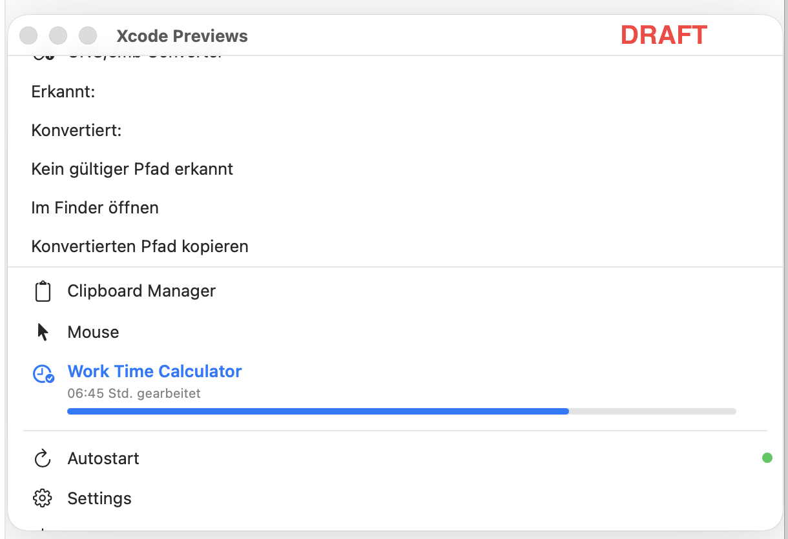
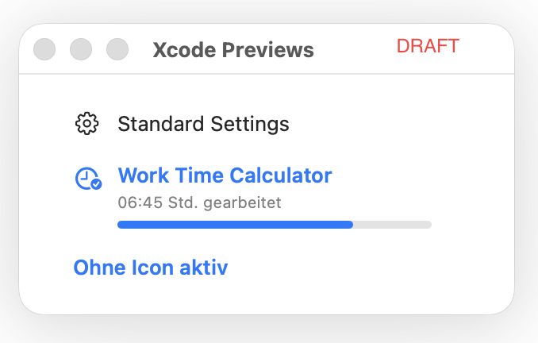

# WindowMenuBarApp


A lightweight macOS menu bar utility app built with SwiftUI. It groups small everyday tools into a compact menu bar window, with an initial focus on UNC/SMB path conversion. 🚀

## Features

- macOS menu bar app experience using `MenuBarExtra`
- Utility-style launcher for small desktop helpers
- UNC/SMB converter section for path inspection and conversion
- Placeholder entries for clipboard tools, mouse tools, and work time calculation
- Native macOS look and feel with SwiftUI ✨

## Screenshots

### Main View



### UNC Converter Subview



## Project Structure

```text
WindowMenuBarApp/
├── WindowMenuBarApp/
│   ├── ContentView.swift
│   ├── WindowMenuBarAppApp.swift
│   └── Views/
│       ├── MenuRow.swift
│       └── UncSmbConverterView.swift
├── Screenshots/
└── WindowMenuBarApp.xcodeproj/
```

## Getting Started

1. Open `WindowMenuBarApp.xcodeproj` in Xcode.
2. Select a macOS target and run the app.
3. The app appears in the macOS menu bar.

## Current Status

This project is currently an early-stage utility app. Some menu entries are already visible in the UI, while parts of the underlying functionality are still being implemented. 🛠️

## Roadmap

- Complete UNC/SMB path detection and conversion logic
- Add clipboard manager functionality
- Add mouse-related utilities
- Add work time calculation features
- Implement settings and autostart behavior

## Tech Stack

- Swift
- SwiftUI
- Xcode macOS app target

## License

Released under the MIT License.